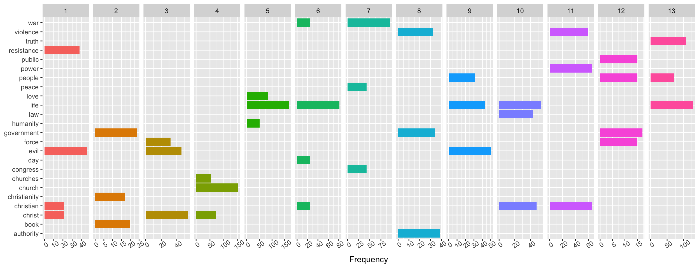

The Kingdom of God Is Within You
================
Jamie Hargreaves
23 March, 2019

Setting up
----------

#### Loading libraries

We'll start by loading the relevant libraries and importing the data: we'll be using tidyverse for packages such as dplyr, ggplot2 and stringr, tidytext as the basis for our text mining, magrittr for its pipes (mainly `%<>%`, since `%>%` is already loaded with tidyverse), and gutenbergr for our book.

``` r
library(tidyverse)
library(tidytext)
library(magrittr)
library(gutenbergr)
```

#### Importing our data

We'll be using [Project Gutenberg](http://www.gutenberg.org/) as the source of our text data. We can see the list of books available from Project Gutenberg using the `gutenberg_metadata` function from the gutenbergr package:

``` r
gutenberg_metadata
```

    ## # A tibble: 51,997 x 8
    ##    gutenberg_id title author gutenberg_autho… language gutenberg_books…
    ##           <int> <chr> <chr>             <int> <chr>    <chr>           
    ##  1            0 <NA>  <NA>                 NA en       <NA>            
    ##  2            1 The … Jeffe…             1638 en       United States L…
    ##  3            2 "The… Unite…                1 en       American Revolu…
    ##  4            3 John… Kenne…             1666 en       <NA>            
    ##  5            4 "Lin… Linco…                3 en       US Civil War    
    ##  6            5 The … Unite…                1 en       American Revolu…
    ##  7            6 Give… Henry…                4 en       American Revolu…
    ##  8            7 The … <NA>                 NA en       <NA>            
    ##  9            8 Abra… Linco…                3 en       US Civil War    
    ## 10            9 Abra… Linco…                3 en       US Civil War    
    ## # … with 51,987 more rows, and 2 more variables: rights <chr>,
    ## #   has_text <lgl>

We can use dplyr and stringr to look for any books similar to our title, since there might be multiple versions available from Project Gutenberg:

``` r
gutenberg_metadata %>%
  filter(str_detect(str_to_lower(title), "kingdom of god")) %>%
  select(title, gutenberg_id)
```

    ## # A tibble: 5 x 2
    ##   title                                                        gutenberg_id
    ##   <chr>                                                               <int>
    ## 1 "\"The Kingdom of God Is Within You\"\r\nChristianity Not a…         4602
    ## 2 "The Kingdom of God is Within You\nChristianity Not as a My…        43302
    ## 3 The Kingdom of God is Within You / Christianity and Patriot…        43372
    ## 4 The Kingdom of God is Within You, What is Art                       43409
    ## 5 The Kingdom of God, Part 1                                          46244

We want the second book in the list, so we'll pass its ID to the `gutenberg_download` function:

``` r
book <- gutenberg_download(43302)
book %<>%
  select(-one_of("gutenberg_id"))

book %>%
  head(12)
```

    ## # A tibble: 12 x 1
    ##    text                                      
    ##    <chr>                                     
    ##  1 "  \"THE KINGDOM OF GOD IS"               
    ##  2 "  WITHIN YOU\""                          
    ##  3 ""                                        
    ##  4 "  [Illustration: titlepage]"             
    ##  5 ""                                        
    ##  6 "  \"THE KINGDOM OF GOD IS"               
    ##  7 "  WITHIN YOU\""                          
    ##  8 ""                                        
    ##  9 "  _CHRISTIANITY NOT AS A MYSTIC RELIGION"
    ## 10 "  BUT AS A NEW THEORY OF LIFE_"          
    ## 11 ""                                        
    ## 12 "  TRANSLATED FROM THE RUSSIAN OF"

### Pre-processing

Before we do anything else, we need to clean the text up a little. We can see already that we have several rows containing only `""` and we also look to have a preface and other text preceeding the first chapter of the book. We'll add chapter and line numbers to our tibble and filter out anything before the first chapter. For the line number we'll use the `row_number()` function from dplyr, and to work out which chapter each line is in we'll use a cumulative sum to count the occurrences of a regular expression `"chapter [\\divxlc]"`, i.e. "chapter" followed by a number or Roman numeral (any combination of "I", "V", "X", "L" or "C"):

``` r
book %<>%
  filter(text != "") %>%
  mutate(
    chapter = cumsum(
      str_detect(text, regex("chapter [\\divxlc]", ignore_case = TRUE))
    )
  ) %>%
  filter(chapter > 0) %>%
  mutate(line = row_number()) %>%
  select(chapter, line, text)

book %>%
  head()
```

    ## # A tibble: 6 x 3
    ##   chapter  line text                                                       
    ##     <int> <int> <chr>                                                      
    ## 1       1     1 CHAPTER I.                                                 
    ## 2       1     2 "     THE DOCTRINE OF NON-RESISTANCE TO EVIL BY FORCE HAS …
    ## 3       1     3 "     PROFESSED BY A MINORITY OF MEN FROM THE VERY FOUNDAT…
    ## 4       1     4 "     CHRISTIANITY."                                       
    ## 5       1     5 "     Of the Book \"What I Believe\"--The Correspondence E…
    ## 6       1     6 "     by it--Letters from Quakers--Garrison's Declaration-…

We should also look at the last lines in the book to make sure we haven't included any appendices or similar sections that might distort our analysis:

``` r
book %>%
  arrange(desc(line))
```

    ## # A tibble: 11,209 x 3
    ##    chapter  line text                                                      
    ##      <int> <int> <chr>                                                     
    ##  1      14 11209 Table of Contents from 279 to 278.                        
    ##  2      14 11208 The transcriber has changed the page number for Chapter X…
    ##  3      13 11207 retained except in obvious cases of typographical error.  
    ##  4      13 11206 Variations in spelling, punctuation and hyphenation have …
    ##  5      13 11205 Text enclosed by plus signs (+Greek+) is a transliteratio…
    ##  6      13 11204 Small capital text has been replaced with all capitals.   
    ##  7      13 11203 Text enclosed by underscores is in italics (_italics_).   
    ##  8      13 11202 Transcriber's note:                                       
    ##  9      13 11201 "       *       *       *       *       *"                
    ## 10      13 11200 "                    THE END."                            
    ## # … with 11,199 more rows

We can see that the book actually ends on line 11,200, so we'll remove any lines after that:

``` r
book %<>%
  filter(line <= 11200)
```

We can now use tidytext's `unnest_tokens()` function to tokenise our text, i.e. convert it to a one-word-per-row tibble:

``` r
book_tokenised <- book %>%
  unnest_tokens(word, text)
```

Project Gutenberg uses `_` to denote words which are italicised, so we're likely to have some of these words in our tokenised tibble:

``` r
book_tokenised %>%
  filter(str_detect(word, "_"))
```

    ## # A tibble: 165 x 3
    ##    chapter  line word      
    ##      <int> <int> <chr>     
    ##  1       1   217 _non      
    ##  2       1   217 resistant_
    ##  3       1   226 _non      
    ##  4       1   226 resistant_
    ##  5       1   284 _i        
    ##  6       1   313 _q        
    ##  7       1   314 _a        
    ##  8       1   315 _q        
    ##  9       1   316 _a        
    ## 10       1   317 _q        
    ## # … with 155 more rows

We've returned some instances of underscored words, so we'll remove them using a regular expression in `str_extract()` from the stringr package:

``` r
book_tokenised %<>%
  mutate(word = str_extract(word, "[\\da-z]+"))
```

Now that our book is tokenised, we need to remove any stop words (like "I", "and", "to" etc.). Luckily, the tidytext package includes a stop-words data set, and we can use `anti_join()` from dplyr along with our tokenised tibble to remove them:

``` r
data(stop_words)

book_tokenised %<>%
  anti_join(stop_words)
```

### Word Analysis

Now that our data is in a tidy format, we can easily start to analyse it using tools from the tidyverse. Let's start by looking at the overall top ten words using dplyr's `top_n()` function and ggplot2:

``` r
book_tokenised %>%
  count(word, sort = TRUE) %>%
  top_n(10) %>%
  ggplot(aes(x = reorder(word, n), y = n)) + 
  geom_col() + 
  coord_flip() + 
  xlab(NULL) + 
  ylab("Frequency")
```


We can also see the top words per chapter; for the sake of readability we'll restrict ourselves to the top 3 words per chapter:

``` r
book_tokenised %>%
  group_by(chapter) %>%
  count(word, sort = TRUE) %>%
  arrange(chapter) %>%
  top_n(3) %>%
  ggplot(aes(x = word, y = n, fill = as.factor(chapter))) +
  geom_col(show.legend = FALSE) + 
  coord_flip() +
  facet_grid(~chapter, scales = "free_x") + 
  xlab(NULL) + 
  ylab("Frequency") + 
  theme(axis.text.x = element_text(angle = 35))
```



### Sentiment Analysis

Next, let's look at performing an analysis of the sentiments of The Kingdom of God Is Within You. We'll use the `AFINN` lexicon to assign a sentiment score to each word in our tokenised data frame. The tidytext package includes a useful `get_sentiments()` function to easily grab the lexicon, and we can use the `inner_join()` function to score each word:

``` r
afinn <- get_sentiments("afinn")

book_sentiments <- book_tokenised %>%
  inner_join(afinn)
```
