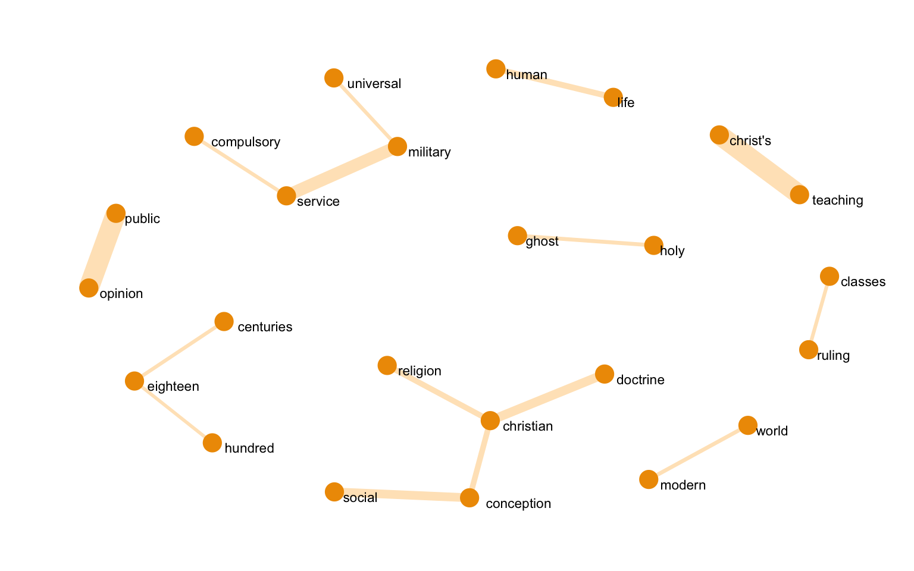
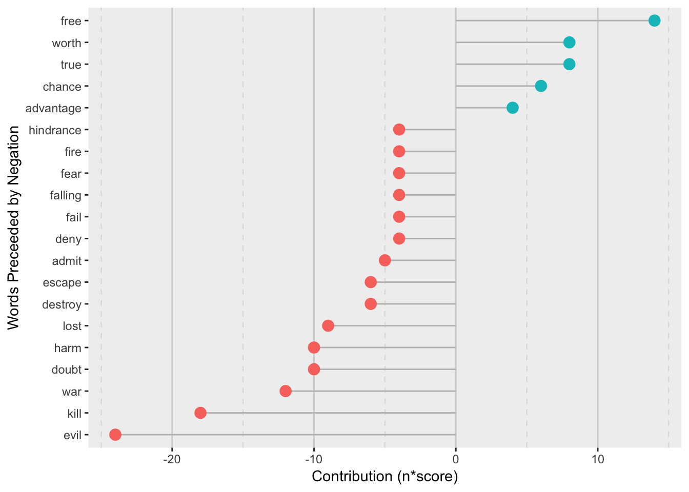

The Kingdom of God Is Within You
================
Jamie Hargreaves
23 March, 2019

<style>
  body{
    font-size: 14px;
  }
</style>
Setting up
----------

#### Loading libraries

We'll start by loading the relevant libraries and importing the data. We'll be using tidyverse for dplyr, ggplot2, tidyr and stringr, tidytext as the basis for our text mining, magrittr for its pipes (mainly `%<>%`, since `%>%` is already loaded with tidyverse), gutenbergr for our book, syuzhet for low pass filtering and ggraph to look at the connections between words. Note that whilst we won't load the library, we'll need to also make sure that the cowplot package is installed, as we'll be making use of the `cowplot::plot_grid()` function later on.

``` r
library(tidyverse)
library(tidytext)
library(magrittr)
library(gutenbergr)
library(syuzhet)
library(ggraph)
```

#### Importing our data

We'll be using [Project Gutenberg](http://www.gutenberg.org/) as the source of our text data. We can see the list of books available from Project Gutenberg using the `gutenberg_metadata` function from the gutenbergr package:

``` r
gutenberg_metadata
```

    ## # A tibble: 51,997 x 8
    ##    gutenberg_id title author gutenberg_autho… language gutenberg_books…
    ##           <int> <chr> <chr>             <int> <chr>    <chr>           
    ##  1            0 <NA>  <NA>                 NA en       <NA>            
    ##  2            1 The … Jeffe…             1638 en       United States L…
    ##  3            2 "The… Unite…                1 en       American Revolu…
    ##  4            3 John… Kenne…             1666 en       <NA>            
    ##  5            4 "Lin… Linco…                3 en       US Civil War    
    ##  6            5 The … Unite…                1 en       American Revolu…
    ##  7            6 Give… Henry…                4 en       American Revolu…
    ##  8            7 The … <NA>                 NA en       <NA>            
    ##  9            8 Abra… Linco…                3 en       US Civil War    
    ## 10            9 Abra… Linco…                3 en       US Civil War    
    ## # … with 51,987 more rows, and 2 more variables: rights <chr>,
    ## #   has_text <lgl>

We can use dplyr and stringr to look for any books similar to our title, since there might be multiple versions available from Project Gutenberg:

``` r
gutenberg_metadata %>%
  filter(str_detect(str_to_lower(title), "kingdom of god")) %>%
  select(title, gutenberg_id)
```

    ## # A tibble: 5 x 2
    ##   title                                                        gutenberg_id
    ##   <chr>                                                               <int>
    ## 1 "\"The Kingdom of God Is Within You\"\r\nChristianity Not a…         4602
    ## 2 "The Kingdom of God is Within You\nChristianity Not as a My…        43302
    ## 3 The Kingdom of God is Within You / Christianity and Patriot…        43372
    ## 4 The Kingdom of God is Within You, What is Art                       43409
    ## 5 The Kingdom of God, Part 1                                          46244

We want the second book in the list, so we'll pass its ID to the `gutenberg_download` function:

``` r
book <- gutenberg_download(43302)
book %<>%
  select(-one_of("gutenberg_id"))

book %>%
  head(12)
```

    ## # A tibble: 12 x 1
    ##    text                                      
    ##    <chr>                                     
    ##  1 "  \"THE KINGDOM OF GOD IS"               
    ##  2 "  WITHIN YOU\""                          
    ##  3 ""                                        
    ##  4 "  [Illustration: titlepage]"             
    ##  5 ""                                        
    ##  6 "  \"THE KINGDOM OF GOD IS"               
    ##  7 "  WITHIN YOU\""                          
    ##  8 ""                                        
    ##  9 "  _CHRISTIANITY NOT AS A MYSTIC RELIGION"
    ## 10 "  BUT AS A NEW THEORY OF LIFE_"          
    ## 11 ""                                        
    ## 12 "  TRANSLATED FROM THE RUSSIAN OF"

### Pre-processing

Before we do anything else, we need to clean the text up a little. We can see already that we have several rows containing only `""` and we also look to have a preface and other text preceeding the first chapter of the book. We'll add chapter and line numbers to our tibble and filter out anything before the first chapter. For the line number we'll use the `row_number()` function from dplyr, and to work out which chapter each line is in we'll use a cumulative sum to count the occurrences of a regular expression `"chapter [\\divxlc]"`, i.e. "chapter" followed by a number or Roman numeral (any combination of "I", "V", "X", "L" or "C"):

``` r
book %<>%
  filter(text != "") %>%
  mutate(
    chapter = cumsum(
      str_detect(text, regex("chapter [\\divxlc]", ignore_case = TRUE))
    )
  ) %>%
  filter(chapter > 0) %>%
  mutate(line = row_number()) %>%
  select(chapter, line, text)

book %>%
  head()
```

    ## # A tibble: 6 x 3
    ##   chapter  line text                                                       
    ##     <int> <int> <chr>                                                      
    ## 1       1     1 CHAPTER I.                                                 
    ## 2       1     2 "     THE DOCTRINE OF NON-RESISTANCE TO EVIL BY FORCE HAS …
    ## 3       1     3 "     PROFESSED BY A MINORITY OF MEN FROM THE VERY FOUNDAT…
    ## 4       1     4 "     CHRISTIANITY."                                       
    ## 5       1     5 "     Of the Book \"What I Believe\"--The Correspondence E…
    ## 6       1     6 "     by it--Letters from Quakers--Garrison's Declaration-…

We should also look at the last lines in the book to make sure we haven't included any appendices or similar sections that might distort our analysis:

``` r
book %>%
  arrange(desc(line))
```

    ## # A tibble: 11,209 x 3
    ##    chapter  line text                                                      
    ##      <int> <int> <chr>                                                     
    ##  1      14 11209 Table of Contents from 279 to 278.                        
    ##  2      14 11208 The transcriber has changed the page number for Chapter X…
    ##  3      13 11207 retained except in obvious cases of typographical error.  
    ##  4      13 11206 Variations in spelling, punctuation and hyphenation have …
    ##  5      13 11205 Text enclosed by plus signs (+Greek+) is a transliteratio…
    ##  6      13 11204 Small capital text has been replaced with all capitals.   
    ##  7      13 11203 Text enclosed by underscores is in italics (_italics_).   
    ##  8      13 11202 Transcriber's note:                                       
    ##  9      13 11201 "       *       *       *       *       *"                
    ## 10      13 11200 "                    THE END."                            
    ## # … with 11,199 more rows

We can see that the book actually ends on line 11,200 so we'll remove any lines after that:

``` r
book %<>%
  filter(line <= 11200)
```

We can now use tidytext's `unnest_tokens()` function to tokenise our text, i.e. convert it to a one-word-per-row tibble:

``` r
book_tokenised <- book %>%
  unnest_tokens(word, text)
```

Project Gutenberg uses `_` to denote words which are italicised, so we're likely to have some of these words in our tokenised tibble:

``` r
book_tokenised %>%
  filter(str_detect(word, "_"))
```

    ## # A tibble: 165 x 3
    ##    chapter  line word      
    ##      <int> <int> <chr>     
    ##  1       1   217 _non      
    ##  2       1   217 resistant_
    ##  3       1   226 _non      
    ##  4       1   226 resistant_
    ##  5       1   284 _i        
    ##  6       1   313 _q        
    ##  7       1   314 _a        
    ##  8       1   315 _q        
    ##  9       1   316 _a        
    ## 10       1   317 _q        
    ## # … with 155 more rows

We've returned some instances of underscored words, so we'll remove them using `str_replace_all()` from the stringr package:

``` r
book_tokenised %<>%
  mutate(word = str_replace_all(word, "_", ""))
```

Now that our book is tokenised, we need to remove any stop words (like "I", "and", "to" etc.). Luckily, the tidytext package includes a stop-words data set, and we can use `anti_join()` from dplyr along with our tokenised tibble to remove them:

``` r
data(stop_words)

book_tokenised %<>%
  anti_join(stop_words)
```

### Single Word Analysis

Now that our data is in a tidy format, we can easily start to analyse it using tools from the tidyverse. Let's start by looking at the overall top ten words using dplyr's `top_n()` function and ggplot2:

``` r
book_tokenised %>%
  count(word, sort = TRUE) %>%
  top_n(10) %>%
  ggplot(aes(x = reorder(word, n), y = n)) + 
  geom_col() + 
  coord_flip() + 
  xlab(NULL) + 
  ylab("Frequency")
```


We can also see the top words per chapter, however for the sake of readability we'll restrict ourselves to the top 3 words:

``` r
book_tokenised %>%
  group_by(chapter) %>%
  count(word, sort = TRUE) %>%
  arrange(chapter) %>%
  top_n(3) %>%
  ggplot(aes(x = word, y = n, fill = as.factor(chapter))) +
  geom_col(show.legend = FALSE) + 
  coord_flip() +
  facet_grid(~chapter, scales = "free_x") + 
  xlab(NULL) + 
  ylab("Frequency") + 
  theme(axis.text.x = element_text(angle = 45))
```


### Analysing *n*-grams

We've done some analysis of the individual words within our book, but to get some more insight we can start to analyse *n*-grams, i.e. sequences of words. We can tokenise our book into bigrams using the `unnest_tokens()` function along with the additional `token = "ngrams"` argument (note that again we'll need remove any underscores from our bigrams):

``` r
book_bigrams <- book %>%
  select(chapter, text) %>%
  unnest_tokens(bigram, text, token = "ngrams", n = 2) %>%
  mutate(bigram = str_replace_all(bigram, "_", ""))

book_bigrams %>%
  head()
```

    ## # A tibble: 6 x 2
    ##   chapter bigram        
    ##     <int> <chr>         
    ## 1       1 chapter i     
    ## 2       1 i the         
    ## 3       1 the doctrine  
    ## 4       1 doctrine of   
    ## 5       1 of non        
    ## 6       1 non resistance

Before we remove any stop words from our bigrams, we'll split them into separate columns using the `separate()` function from tidyr:

``` r
book_bigrams_separated <- book_bigrams %>%
  separate(bigram, c("word1", "word2"), sep = " ")

book_bigrams_separated %>%
  head()
```

    ## # A tibble: 6 x 3
    ##   chapter word1    word2     
    ##     <int> <chr>    <chr>     
    ## 1       1 chapter  i         
    ## 2       1 i        the       
    ## 3       1 the      doctrine  
    ## 4       1 doctrine of        
    ## 5       1 of       non       
    ## 6       1 non      resistance

Now we'll use the `stop_words` dataset to remove any stop words, unite the data and take a look at the most frequent bigrams:

``` r
book_bigrams_filtered <- book_bigrams_separated %>%
  filter(!word1 %in% stop_words$word) %>%
  filter(!word2 %in% stop_words$word)

book_bigrams_filtered %>%
  unite(bigram, word1, word2, sep = " ") %>%
  count(bigram, sort = TRUE) %>%
  top_n(10) %>%
  ggplot(aes(x = reorder(bigram, n), y = n)) +
  geom_col() +
  coord_flip() + 
  xlab(NULL) + 
  ylab("Frequency")
```



To visualise how these terms are connected, we can make use of the `ggraph` package to produce a network graph of common bigrams:

``` r
set.seed(100)

book_bigrams_filtered %>%
  count(word1, word2, sort = TRUE) %>%
  filter(n > 10) %>%
  igraph::graph_from_data_frame() %>%
  ggraph(layout = "kk") + 
  geom_edge_link(
    aes(width = n), 
    alpha = 0.3, 
    colour = "orange", 
    show.legend = FALSE
  ) + 
  geom_node_point(colour = "orange2", size = 5) + 
  geom_node_text(aes(label = name), vjust = 1, hjust = -0.25, size = 3) + 
  coord_cartesian(clip = "off") + 
  theme_graph()
```


The thicker the connection between two words, the more frequently those words appeared together. We can see that a word like "christian" forms a central node reflecting its prominence throughout the book, and we can see the prominence of topics such as military service and "christ's teaching".

### Sentiment Analysis

Next, let's look at performing some sentiment analysis. We'll use the `AFINN` lexicon to assign a sentiment score to each word in our tokenised data frame. The tidytext package includes a useful `get_sentiments()` function to easily grab the lexicon, and we can use the `inner_join()` function to score each word:

``` r
afinn <- get_sentiments("afinn")

book_sentiments <- book_tokenised %>%
  inner_join(afinn)
```

We want to calculate the net sentiment over a sensible period; we could look at net sentiment per chapter, but it's unlikely to tell us anything truly meaningful since a lot of the nuance would likely be lost. Instead, we'll look at the net sentiment per "paragraph" which I'm going to define to be every 50 words (remembering that we've taken out a lot of stop-words, so our "paragraphs" should probably be somewhat shorter than a typical, physical paragraph).

``` r
book_sentiments %>%
  mutate(paragraph = row_number()%/%50) %>%
  group_by(paragraph) %>%
  summarise(netscore = sum(score)) %>%
  ggplot(aes(x = paragraph, y = netscore)) + 
  geom_col() + 
  xlab("Paragraph") + 
  ylab("Net Sentiment Score")
```


As an aside, we can create a smoothed approximation of the net sentiment score to get a clearer idea of the general sentiment trend as the book goes on (we'll use the syuzhet package for this):

``` r
# net sentiment score per paragraph
sentiment_per_paragraph <- book_sentiments %>%
  mutate(paragraph = row_number()%/%50) %>%
  group_by(paragraph) %>%
  summarise(netscore = sum(score)) 

# original plot
net_sentiment_raw <- sentiment_per_paragraph %>%
  ggplot(aes(x = paragraph, y = netscore)) + 
  geom_col() + 
  xlab("Paragraph") + 
  ylab(NULL)

# transformed plot
smooth_sentiment <- get_dct_transform(sentiment_per_paragraph[[2]], low_pass_size = 15, 
                                      scale_vals = TRUE, 
                                      x_reverse_len = nrow(sentiment_per_paragraph))

book_theme <- data.frame(paragraph = 1:length(smooth_sentiment), score = smooth_sentiment) %>%
  as_tibble()

net_sentiment_trans <- book_theme %>%
  ggplot(aes(x = paragraph, y = score)) +
  geom_col(width = 0.3, fill = "orange") + 
  geom_line(colour = "orange2", size = 1.1) + 
  xlab("Paragraph") + 
  ylab(NULL)

cowplot::plot_grid(net_sentiment_raw, net_sentiment_trans, labels = NULL)
```


Whilst the above is insightful, it doesn't take into account context. When we remove stop-words, we also remove negations, meaning phrases like "no good" and "not happy" are truncated to "good" and "happy", and (misleadingly) receive a positive sentiment score. We can look at words preceeded by negations such as "no", "not" or "never" using the bigrmas we created previously:

``` r
negations <- c("no", "not", "never")
stop_words_filtered <- stop_words %>%
  filter(!word %in% negations)

bigram_negations <- book_bigrams_separated %>%
  filter(!word1 %in% stop_words_filtered$word) %>%
  filter(!word2 %in% stop_words$word) %>%
  filter(word1 == "no" | word1 == "not" | word1 == "never") 

bigram_negations %>%
  count(word1, word2, sort = TRUE) %>%
  head(10)
```

    ## # A tibble: 10 x 3
    ##    word1 word2          n
    ##    <chr> <chr>      <int>
    ##  1 not   free          14
    ##  2 not   understand    12
    ##  3 no    doubt         10
    ##  4 not   recognize     10
    ##  5 not   evil           7
    ##  6 no    external       6
    ##  7 no    war            6
    ##  8 not   kill           6
    ##  9 not   opposed        6
    ## 10 no    meaning        5

We can then look at how much these words have "mislead" us by looking at the overall contribution of each word to the net sentiment, i.e. the word's sentiment score multiplied by the number of times it occurs:

``` r
negation_contribution <- bigram_negations %>%
  count(word2, sort = TRUE) %>%
  inner_join(afinn, by = c(word2 = "word")) %>%
  mutate(contribution = n * score) %>%
  arrange(desc(abs(contribution)))
  
negation_contribution
```

    ## # A tibble: 90 x 4
    ##    word2      n score contribution
    ##    <chr>  <int> <int>        <int>
    ##  1 evil       8    -3          -24
    ##  2 kill       6    -3          -18
    ##  3 free      14     1           14
    ##  4 war        6    -2          -12
    ##  5 doubt     10    -1          -10
    ##  6 harm       5    -2          -10
    ##  7 lost       3    -3           -9
    ##  8 true       4     2            8
    ##  9 worth      4     2            8
    ## 10 escape     6    -1           -6
    ## # … with 80 more rows

This time, rather than a bar chart, we'll use a "lollipop" plot to visualise the contribution:

``` r
negation_contribution %>%
  head(20) %>%
  ggplot(aes(x = reorder(word2, contribution), y = contribution)) + 
  geom_segment(aes(x = reorder(word2, contribution), 
                      xend = 
                      reorder(word2,contribution), 
                      y = 0, 
                      yend = contribution), 
                      colour = "gray") +
  geom_point(aes(colour = contribution > 0), show.legend = FALSE, size = 3.5) +
  coord_flip() + 
  xlab("Words Preceeded by Negation") + 
  ylab("Contribution (n*score)") +
  theme(
    plot.background = element_blank(),
    panel.background = element_rect(fill = "gray94"),
    panel.grid.major.y = element_blank(),
    panel.grid.minor.y = element_blank(),
    panel.grid.major.x = element_line(colour = "lightgray"),
    panel.grid.minor.x = element_line(colour = "lightgray", linetype = "dashed")
  )
```



We can see that negations of "evil", kill" and "free" are responsible for a large amount of the false sentiment scoring.

### Conclusion

As we can see, by utilising tidy principles and tools, we can quickly (and fairly easily) start to analyse text data and establish common themes and sentiments.
